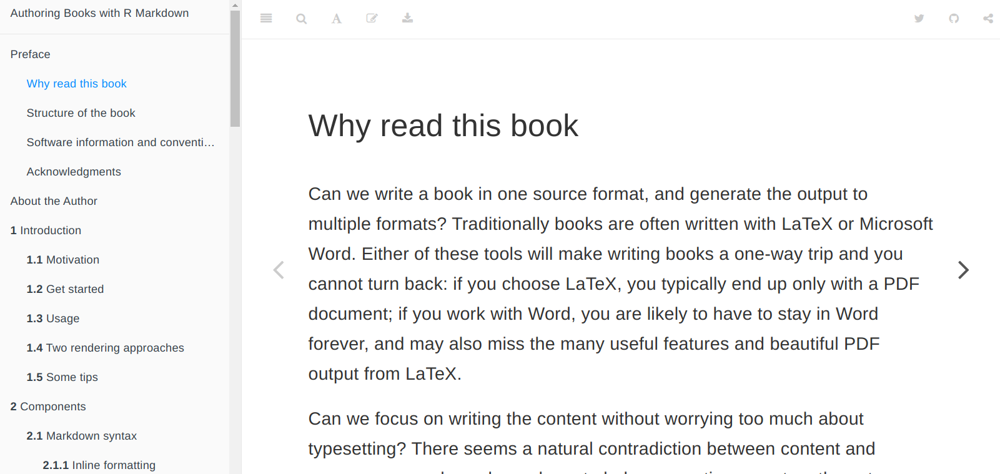

```{r setup, include=FALSE}
knitr::opts_chunk$set(echo = FALSE)
library(knitr)
```


## Objectives


- 純概念、不實際操作

- 放輕鬆

- 學習資源

--


---

class: inverse, center, middle

# Advanced Topic: <br>.s[Bibliographies & Citations]

---

## Bibliographies & Citations

.pull-left[

#### .l[Prerequisites]

1. BibTeX: `ref.bib` .ms[(1 entry)]

    <pre><code class='bib hljs nix remark-code'>@article{<span class="remark-code-span-highlighted">leung2008</span>,
      title = {Multicultural Experience Enhances Creativity},
      year = {2008},
      journal = {American Psychologist},
      author = {Leung, Angela Ka-yee and Maddux, William W.},
    }
    </code></pre>

1. 文獻引用格式: `apa.csl`

  .s[下載：[Official CSL Repo](https://github.com/citation-style-language/styles), [Zotero Style Repo](https://www.zotero.org/styles)]
]


--

.pull-right[

#### .l[Workflow]

1. **書目管理軟體**整理文獻  
.s[
(推薦 [Zotero](https://www.zotero.org) + [Better BibTeX extension](https://retorque.re/zotero-better-bibtex)<sup>＊</sup>)
]

1. 透過**書目管理軟體**匯出 `.bib` 檔

1. 使用 [Citation Syntax](https://rmarkdown.rstudio.com/authoring_bibliographies_and_citations.html#citation_syntax) 插入引用文獻  
(or 使用 [`citr` 套件](https://github.com/crsh/citr) 幫助你)
    
  <pre><code class='md hljs markdown remark-code'>Leung says blah blah <span class="remark-code-span-highlighted">[-@leung2008]</span>.
  </code></pre>

.footnote[.s[
[.s[＊]]: .s[(就我所知)] Zotero 是目前唯二[可控制 `.bib` 檔之 citekey pattern](https://retorque.re/zotero-better-bibtex/citation-keys) 的免費書目管理軟體。

[Zotero + R Markdown Tutorial](https://ikashnitsky.github.io/2019/zotero)
]]

]

---

## Bibliographies & Citations .ms[(Cont.)]

### Two Systems .ms[(again)]

.pull-left[

- [Pandoc citeproc](https://github.com/jgm/pandoc-citeproc)
    - Support: HTML & PDF (LaTeX)
    
    - YAML Frontmatter
    
    ```yml
    *bibliography: ref.bib
    *csl: apa.csl
    output: bookdown::html_document2
    ```
]

.pull-right[
- $\LaTeX$ citation package (`biblatex` or `natbib`)
    - Support: PDF (LaTeX) only
    
    - YAML Frontmatter  
    
    ```yml
    *bibliography: ref.bib
    output:
      bookdown::pdf_document2:
    *   citation_package: natbib
    ```
]

---

class: inverse, center, middle

# R Markdown Ecosystem

---

background-image: url(https://bookdown.org/yihui/bookdown/images/cover.jpg)
background-size: 20%
background-position: 85% 40%

## 書籍撰寫 (bookdown)

- [bookdown book](https://bookdown.org/yihui/bookdown) ([PDF](https://bookdown.org/yihui/bookdown/bookdown.pdf)): 學習 R Markdown 的好資源

--

- 同時輸出 [GitBook](https://www.gitbook.com) 與 PDF Book
    - 可以拿來[寫論文](https://github.com/liao961120/ntuthesis)

<br>


---

background-image: url(img/twlangsurvey.gif)
background-size: 65%
background-position: 91% 88%

## 網站: [R Markdown Websites](https://bookdown.org/yihui/rmarkdown/rmarkdown-site.html)

- 適合製作**簡單**網站

  - 單頁 .s[or] 少量頁面


.footnote[.ms[
<https://twlangsurvey.github.io>
]]

---

background-image: url(https://bookdown.org/yihui/blogdown/images/logo.png)
background-position: 80% 20%

## 部落格 (blogdown)

- [blogdown book](https://bookdown.org/yihui/blogdown) ([PDF](https://bookdown.org/yihui/blogdown/blogdown.pdf))
  

- Why start a blog?

--

- 架站太難？

  .s[不會架站，也能[體驗用 R Markdown 寫部落格](https://collabin.netlify.com/info/about)]

???
Why Start a blog?
- 整理、記錄自己做過什麼
- 從寫作當中學習