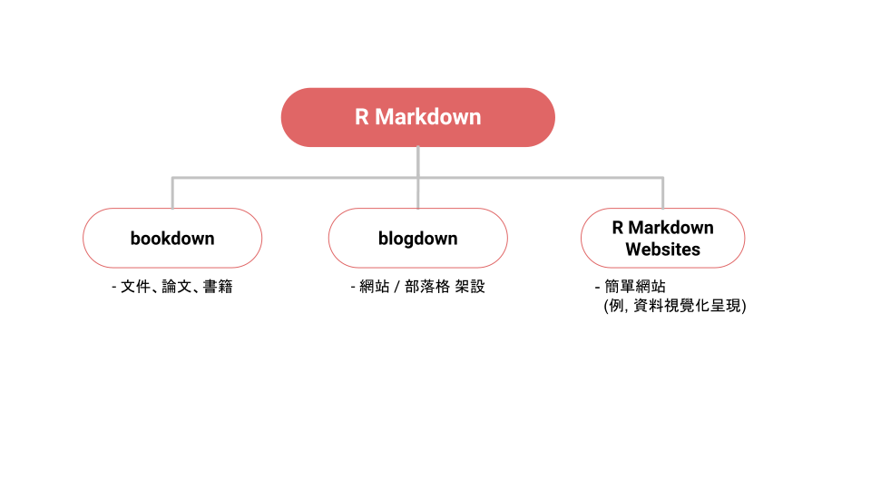

```{r setup, include=FALSE}
knitr::opts_chunk$set(echo = FALSE)
library(knitr)
```


class: center, middle, inverse
background-color: black

# Part Ⅱ
# .l[Applications]


???
接下來要進入今天的尾聲了。

這部份不會有實際的操作，大家就輕鬆的聽聽就好。  
它的目的只是提供一些學習資源，讓想要更深入學習 R Markdown 的人，知道要從哪裡開始。

---

background-image: url(https://pbs.twimg.com/media/DDzY0_BXcAA1xQw.png)
background-position: 50% 65%
background-size: 80%

## Ecosystem of R Packages


.footnote[.ms[.ms[
https://twitter.com/drob/status/881818094011854848
]]]

???
這張圖是 R 套件所組成的一個網絡圖。從這張圖，你大概可以看出來 R 套件形成了一個個的子領域，

譬如說最中間、最大的那個就是「資料前處理」的相關套件，在「資料前處理」的正下方，是以 ggplot2 為主而形成的「資料視覺化」的相關套件。

那大家可以看到這邊還有非常多的子領域，而每個人有興趣的領域可能會不一樣。像我自己就很喜歡 R Markdown，所以我就一直在這領域裡面打滾、把 R Markdown 相關的套件都玩的很熟。這在不知不覺中，大幅的提昇了我 R 語言的功力。

我這邊想要鼓勵大家去探索 R 套件的生態圈。  
在這個過程中你可能會發現一個你很感興趣的套件，那這個套件就會是你的好夥伴，它會讓你在學習 R 語言上變得非常有動力。隨著你越來越熟悉這個套件，你也會開始認識到周圍的、其它相關的套件。這些套件或許會更有趣，那你可能就會更進一步的去探索這些套件。

這個反覆的過程能夠讓你很快樂的學習 R 語言，同時也會讓你 R 語言的功力快速成長。

---

background-image: url(https://imgy.netlify.com/gif/jump-off.gif)
background-position: center
background-size: 100%
background-color: black
count: false

???
那在探索未知的套件的時候，你常常會需要接觸完全陌生的東西。這看起來還蠻困難的，有時候你甚至會不敢去嘗試。但是常常在你真正踏出第一步 去嘗試過後，你才會發現其實並沒有像想像中的那麼困難。

有時候，我們就是需要一個開頭、一個引子，好讓我們知道要如何跨出第一步。那我這邊，就提供一些，我覺得相當不錯的學習資源給大家參考。


---

## bookdown.org .ms[.ms[(https://bookdown.org)]]


### R Basics

- [Hands-On Programming with R](https://rstudio-education.github.io/hopr)

- [R for Data Science](https://r4ds.had.co.nz)

### Special Domain

- [Text Mining with R](https://www.tidytextmining.com)

- [Geocomputation with R](https://geocompr.robinlovelace.net/)

<iframe src='https://bookdown.org/' style='position:absolute;left:38%;top:20%;width:63%;height:450px'></iframe>


???
bookdown 是一個 R Markdown 生態圈裡的套件，它讓 R Markdown 可以用來寫書。bookdown.org 是一個收錄這些使用 bookdown 套件撰寫的書籍。你可以在這個網站裡，看到很多 R 語言相關的書籍，這當中有不少相當不錯的書。

我這邊列出的四本是我看過，而且我覺得寫得相當好的書。前面兩本是關於 R 語言本身的介紹。後面兩本就是特殊的領域，像這邊是文字探勘還有地理資訊的領域。

---

class: inverse, center, middle

# R Markdown Ecosystem

???
剛剛是比較 general 的 R 套件生態圈的學習資源。如果你的興趣和我一樣都是 R Markdown 的話，我這裡可以提供一些關於 R Markdown 的建議。

---

class: center,middle




???
前面講過，R Markdown 能夠輸出成很多種格式。依據不同的目的，你會需要使用不同的套件。

1. 如果使用 R Markdown 的目的就和今天介紹的主軸一樣，也就是，你希望用 R Markdown 寫筆記、寫文件或是寫作業這類比較「傳統」的文書處理，那你應該探索的是 bookdown 這個套件。

2. 如果你對網頁比較有興趣，而且想架設一個個人網站，那你可以從 blogdown 這個套件開始探索。

3. 最後，是 R Markdown Websites。這個不是一個套件，它是 rmarkdown 所提供的一種輸出格式。它跟 blogdown 不同的地方在於， R Markdown Websites 適合做的是比較簡單的網站，像是只有一個頁面的那種網站。所以，譬如說，你可以用 R Markdown Websites 來呈現資料視覺化專案的成果。

之後的幾張投影片就是這些 R Markdown 相關套件的學習資源。大家可以依據自己的興趣和需求，去更深入的了解這些套件。

---

background-image: url(https://bookdown.org/yihui/bookdown/images/cover.jpg)
background-size: 20%
background-position: 85% 40%

## 書籍撰寫 (bookdown)

- [bookdown book](https://bookdown.org/yihui/bookdown) ([PDF](https://bookdown.org/yihui/bookdown/bookdown.pdf)): 學習 R Markdown 的好資源

- 同時輸出 [GitBook](https://www.gitbook.com) 與 PDF Book
    - 可以拿來[寫論文](https://github.com/liao961120/ntuthesis)

<br>


---

background-image: url(img/twlangsurvey.gif)
background-size: 65%
background-position: 91% 88%

## 網站: [R Markdown Websites](https://bookdown.org/yihui/rmarkdown/rmarkdown-site.html)

- 適合製作**簡單**網站

  - 單頁 .s[or] 少量頁面


.footnote[.ms[
<https://twlangsurvey.github.io>
]]

---

background-image: url(https://bookdown.org/yihui/blogdown/images/logo.png)
background-position: 85% 75%

## 部落格 (blogdown)

- [blogdown book](https://bookdown.org/yihui/blogdown) ([PDF](https://bookdown.org/yihui/blogdown/blogdown.pdf))
  

- [Why start a blog?](http://varianceexplained.org/r/start-blog)

- 架站太難？

  .s[不會架站？先[體驗用 R Markdown 寫部落格](https://collabin.netlify.com/info/about)]

???
Why Start a blog?
- 整理、記錄自己做過什麼
- 從寫作當中學習