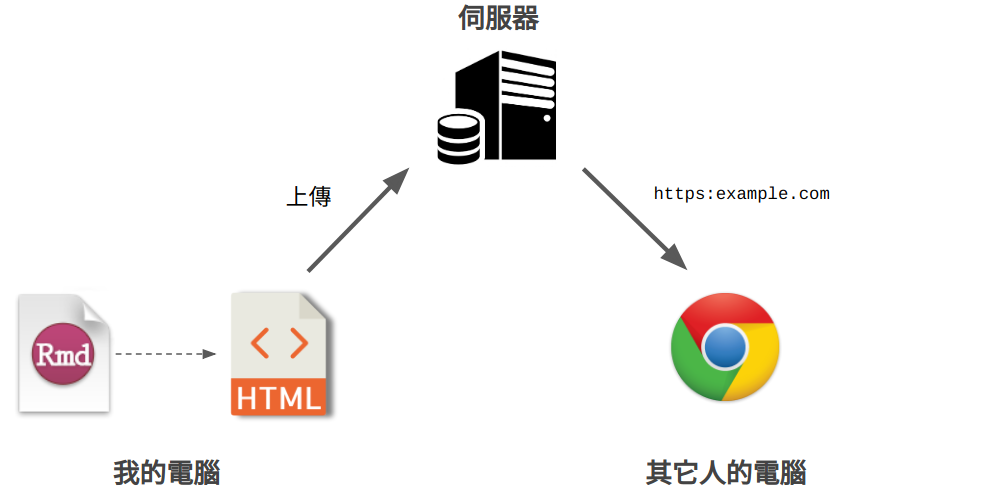

```{r setup, include=FALSE}
knitr::opts_chunk$set(echo = FALSE, fig.align = 'c')
library(knitr)
```


class: inverse, center, middle

# Hosting HTML Files on Web


---

class: center

<br>



???
大家剛剛已經學會將 R Markdown 輸出成 HTML 的文件了。那現在有了 HTML，我們需要一個方式讓我們分享這個 HTML 檔。

如果直接把 HTML 檔傳給別人會很奇怪，想想看自己有收到過 HTML 檔嗎？  
我們當然希望能夠直接給人家一個網址，讓他點進去就可以看到我們用 R Markdown 輸出的 HTML。

那要做到這件事，我們需要一個 24 小時持續運作的伺服器，幫我們儲存 HTML 檔，讓知道網址的人可以閱讀我們放在伺服器上的 HTML。

---

## Updog


#### 註冊 Updog

1. Visit [updog.co](https://updog.co/)
1. `Get Started`
1. `Sign in with Google / Dropbox`
1. 輸入 `site name`


#### R Markdown ➜ HTML ➜ Updog 網頁

1. 使用剛剛的 `code_chunk_prac.Rmd`

1. 將 `code_chunk_prac.html` 上傳至  
雲端硬碟的 `Updog/<site-name>`

1. 等 30 秒左右，就可以在  
.s[[https://`<site-name>`.updog.co/code_chunk_prac.html]()]  
看到輸出的 HTML 了

???
Updog 就是一個提供靜態網頁伺服器的服務。它讓使用者能把雲端硬碟當成伺服器使用。

換句話說，你只要將 HTML 上傳到雲端硬碟裡的某個資料夾，那你之後就可以透過網址瀏覽這個 HTML 所形成的網頁。

(使用 liao961120)
這邊大家可以用 Dropbox 或是 Google drive 的帳號直接註冊 Updog。我在這邊實際示範一次從註冊 Updog 到上傳 HTML 檔。

---

## [GitHub](https://github.com)  .s[(A Better Option)]


- <s>世界最大男性社交網站</s>

- 原始碼[版本控制](https://zh.wikipedia.org/zh-tw/版本控制) (備份)、專案規劃與管理、合作開發

- 許多軟體開發相關的實用、免費服務

- 架設網站

- 轉個彎之後 ...  
  .ms[[寫論文](https://github.com/sih4sing5hong5/huan1-ik8_lun7-bun5)、[課程管理](https://happygitwithr.com/classroom-overview.html)]


.footnote[.ms[
快速上手：[透過 GitHub 架設靜態網頁](https://liao961120.github.io/2018/04/20/gsheet_survey.html#靜態網頁-設置)  

學習資源：
  - https://lab.github.com
  - [Happy Git and GitHub for the useR](https://happygitwithr.com)
]]

???
剛剛介紹的 Updog 是個能快速上手的服務。

但是日後，如果你們還有持續使用 R 或是 R Markdown，你們電腦裡的檔案數量應該會開始倍增。這種情況下，檔案管理和備份就開始變得很重要。而雲端硬碟並不是一個適合檔案管理的工具。

我這邊要推薦 GitHub 這套服務。那有個笑話是說，GitHub 是號稱全世界最大的男性社交網站，因為上面的使用者很大比例都是從事軟體開發相關工作的男性。

**所以 GitHub 到底是什麼呢？**  
其實 GitHub 是一個提供軟體開發時，程式碼版本控制的服務。那版本控制是什麼？這一時說不清楚，但你們可以把它想像成一種非常可靠的備份程式碼的方式。

那除了備份程式碼，GitHub 也提供了軟體開發過程中 會用到的其它服務，**包含網站的架設**。簡單來說，GitHub 就是一個減輕軟體開發負擔的綜合服務。


那因為 GitHub 的服務是免費的，而且它也沒規定你一定要把它用在軟體開發。  
所以轉個彎之後，我們可以把 GitHub 拿來做很多事情。譬如說，很多研究人員，是使用 GitHub 來管理自己的研究的。更不用說，有很多碩博士生是使用 GitHub 來管理他的論文的。GitHub 甚至可以用在課程教學上。

--

.l[
> ***The only limit is your imagination!***

]

