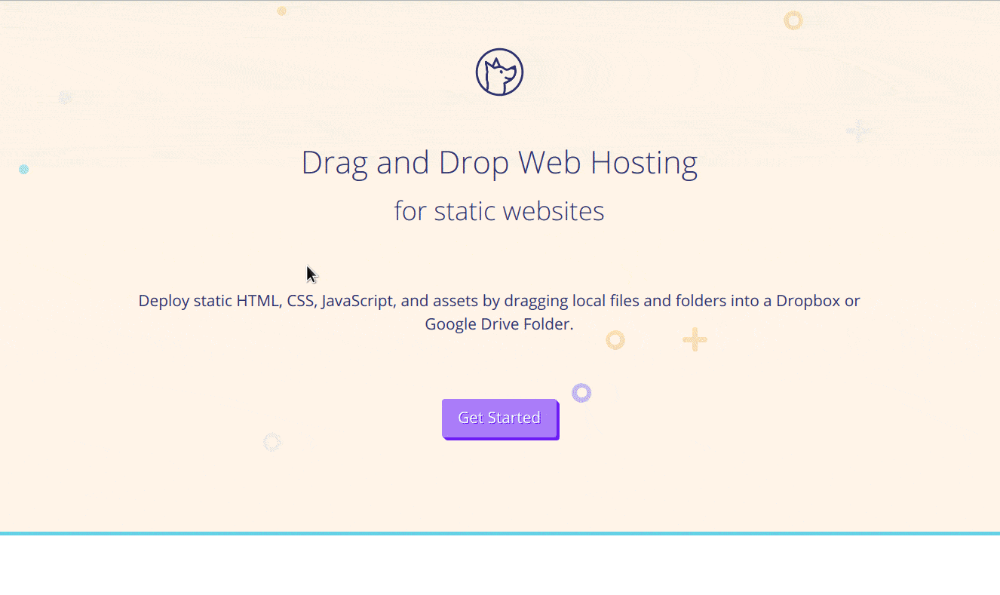

```{r setup, include=FALSE}
knitr::opts_chunk$set(echo = FALSE, fig.align = 'c')
library(knitr)
```


class: inverse, center, middle

# Hosting HTML Files on Web

---

## Updog



#### 註冊 Updog

1. Visit [updog.co](https://updog.co/)
1. `Get Started`
1. `Sign in with Google / Dropbox`
1. 輸入 `site name`

#### R Markdown ➜ HTML ➜ Updog 網頁

1. 下載 [`minimal_html`](https://minhaskamal.github.io/DownGit/#/home?url=https://github.com/liao961120/2019-fju-rmd-talk/tree/master/minimal_html)

1. RStudio:   
.smaller[`html_article.Rmd` ➜ `html_article.html`]

1. 將 `html_article.html` 上傳至  
雲端硬碟: `Updog/<site-name>`

1. 等 30 秒左右，就可以在  
.smaller[[https://`<site-name>`.updog.co/html_article.html]()]  
看到輸出的 HTML 了


---


## [GitHub](https://github.com)  (A Better Option)


- <s>世界最大男性社交網站</s>

- 原始碼託管 (只要開源，完全免費)

- 許多軟體開發相關的實用、免費服務

- 架設網頁


.footnote[
[透過 GitHub 架設靜態網頁](https://liao961120.github.io/2018/04/20/gsheet_survey.html#靜態網頁-設置)
]