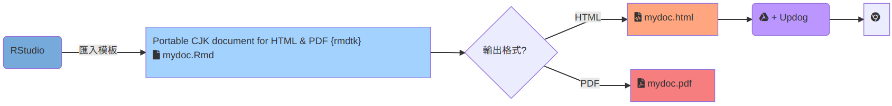

```{r setup, include=FALSE}
knitr::opts_chunk$set(echo = FALSE, fig.align = 'center')
library(knitr)
options(knitr.duplicate.label = 'allow')
```


background-image: linear-gradient(to bottom, rgba(0,0,0,0.2) 30%, rgba(0,0,0,0.2) 100%), url(https://liao961120.github.io/slides/img/bg/coffee-blur.jpg)
background-position: center
background-size: cover

class: title-slide

.bg-text[
.larger[
# Introduction to R Markdown
]

### .s[A Tool Enabling You to Create, Write, & Share Ideas]

<hr />
.little-larger[
April 22, 2019  
廖永賦  
[bit.ly/fju-rmd](http://bit.ly/fju-rmd)
]
]

???
我今天要介紹的是 R Markdown。相信大家都對這個東西很陌生，不知道它是什麼東西。所以我就先從我自己的經驗以及我對於 R Markdown 的看法出發。


---

```{r child='opening.Rmd'}
```

---

class: center, middle, inverse
background-color: black

# Part Ⅰ
# .larger[R Markdown Basics]

???
接下來，我要正式進入 R Markdown 的介紹了。透過今天對 R Markdown 的介紹，我希望能達成兩個目標：

---

## Objectives

.larger[
1. Rmd ➜ HTML ➜ share through `URL`

1. Rmd ➜ PDF
]

```{r}
include_graphics('img/rmd_flow.png')
```


???

1. 第一，大家在今天結束前能夠透過 R Markdown 輸出網頁，並透過網址分享給別人。
1. 第二，大家有能力以 R Markdown 取代 Word 撰寫紙本作業或報告，並且輸出成 PDF 檔。

---

```{r child = 'what_is_md.Rmd'}
```

---

```{r child = 'rmd_components.Rmd'}
```

---

```{r child = 'host_rmd_on_web.Rmd'}
```

---

```{r child = 'pdf_report.Rmd'}
```

---

class: center

## Part Ⅰ: Wrap Up

<!--

-->

<br><br><br>



---

```{r child = 'citation.Rmd'}
```

---

class: center, middle, inverse
background-color: black

# Part Ⅱ
# .l[Applications]

---

```{r child='applications.Rmd'}
```

<!-- Ending -->

---

background-image: url(https://liao961120.github.io/slides/img/pictures/cabin.jpg)
background-position: center
background-size: cover

class: center, inverse

# .l[Thank You]

---

background-image: url(https://liao961120.github.io/slides/img/pictures/cabin.jpg)
background-position: center
background-size: cover

class: center, inverse


---

background-image: linear-gradient(to bottom, rgba(255,255,255,0.8) 0%, rgba(255,255,255,0.8) 100%), url(https://liao961120.github.io/slides/img/pictures/cabin.jpg)
background-position: center
background-size: cover


<br><br>

# Contact Info


### Yongfu Liao
.l[
- <https://liao961120.github.io>

-  [liao961120](https://github.com/liao961120)

]


.footnote[
.s[
### .s[Questions]

- File an issue at [ liao961120/2019-fju-rmd-talk](https://github.com/liao961120/2019-fju-rmd-talk/blob/master/README.md) (Preferred)

- Email

]]

