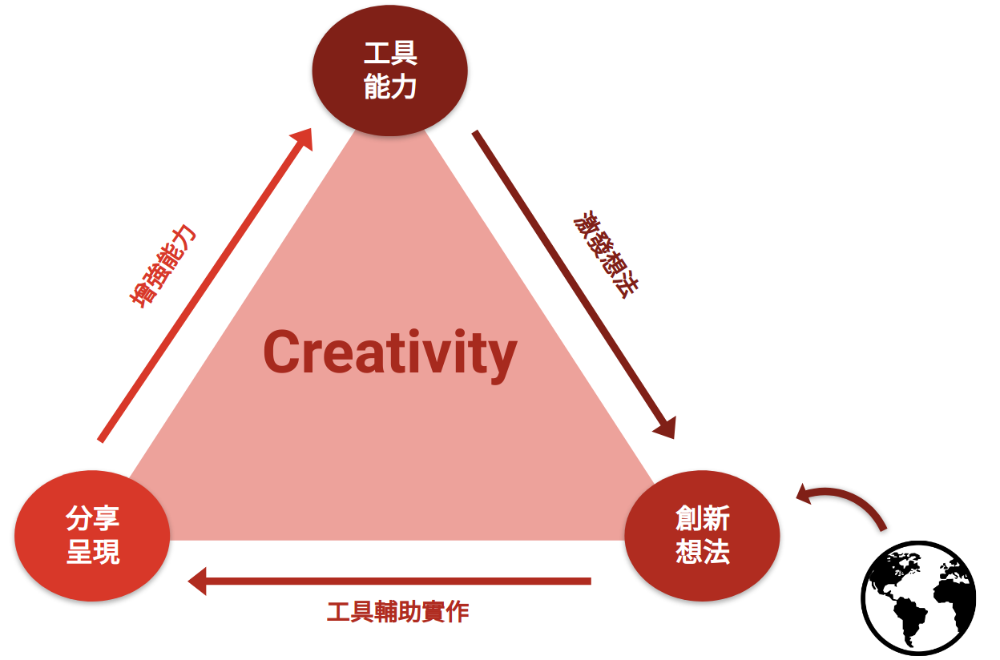
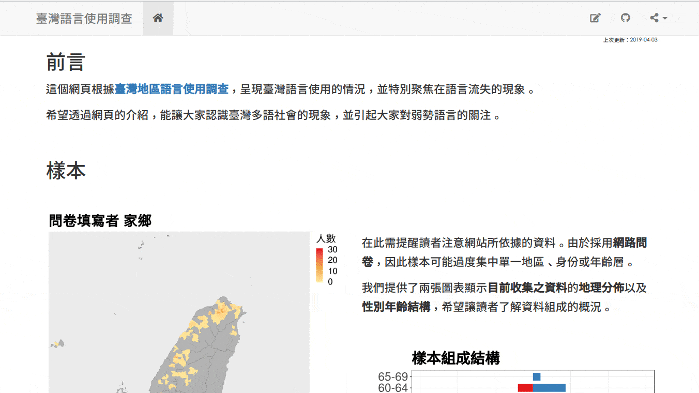
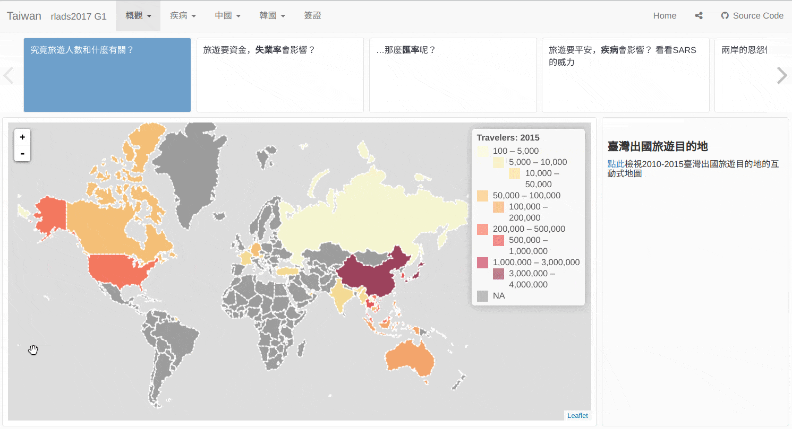

```{r setup, include=FALSE}
knitr::opts_chunk$set(echo = FALSE, fig.align = 'center')
library(knitr)
```

???
我從小到大花了很多時間在「讀書」上，從基測、學測到大一大二都是如此。但有時候我會感到很焦慮，可能是因為年紀大了所以開始會有些就業壓力。我常常會問自己，「我花了這麼多時間在學習上，但我真的有學『到』什麼嗎？今天如果我去申請研究所或是求職面試，我有真正**屬於自己的東西或能力**可以拿出來說嘴嗎？」

我發現沒有

我也發現我沒有真正學到東西的原因是因為，我從小到大的學習都只是在「被動餵食」，但我卻沒有學到一項真正重要的能力，那就是**創造**新事物的能力。簡單來說，我是個只會考試，但沒有任何創造力的人。

這裡先偏題一下，「創造力」其實是一種複雜的東西，它在心理學裡面有很多人在研究，但心理學家對於「創造力」是什麼還在爭論不休。但有一點很確定的是，「創造力」不像智力或是運動天賦這種一出生就決定大半的**個人能力**。「創造力」是在一個系統中，很多因素長期彼此配合，逐漸**被孕育**出來的現象。

就我自己所體悟到的，為何我自己在 21 歲之前是個沒什麼創造力的人，我發現只有一個關鍵的原因，那就是我**沒有動機去創造東西**。而且很微妙的一點是，這種**沒有動機**是沒辦法被直接解決的。因為它是一整個，孕育創造力的系統，的問題。  
而且事實上，我當初甚至沒有意識到有這個問題需要被解決，我完全是在誤打誤撞之下，轉對了一個正確的旋鈕，讓這個所謂孕育創造力的系統能開始運行。

這個系統在今天的脈絡下，大概能用這張圖表示：

`--`

---

```{r fig.align='right', out.width='90%'}

```


???
我覺得創造力的動機來源就是這張圖的左下角，也就是渴望將自己的想法或創造的事物分享給其他人的動機。

這個動機是推動創造力產生的燃料，但這個動機不會自發產生，而最根本的原因是我們沒有工具以及能力，能輕鬆的達成這件事。

就舉一個比較貼近學生生活的例子，像是學校的的期末報告。  在我們完成的期末報告當中，有多少是在學期末 報告當天之後，就塵封在電腦裡或是雲端硬碟的某處，再也沒人看過？  

因為我們長久下來的習慣是用 PDF 和 Powerpoint 的方式呈現期末報告成果，報告所能觸及的就是報告當天在場的那群人。所以基本上，有時我們在做期末報告會敷衍了事是很正常的，畢竟我們為什麼要花這麼多力氣在一個馬上就會被世界所遺忘的事情上呢？

但是..想想看  
今天如果我們能夠使用 「**網頁**」 去呈現我們的報告成果，那我們能觸及的就不只是報告當天的那群人，而是全世界。我們做的報告也會在報告當天結束後，繼續「活在網路上」。你不會確定有誰會去看它，但你很可能會意外的啟發 看了你的報告的人。

我覺得這就是，推動我去創造的動力來源。而這個動力之所以能這麼順暢地推動我，是因為我能夠隨心所欲的使用工具來幫助自己達成目標 -- 也就是能透過自己架設的網頁，將想法分享其他人。

我今天要介紹的，就是這個幫助我輕鬆地在網頁上呈現自己的創作和想法的工具。這個工具就是 R Markdown。

---

### 透過 R Markdown 分享至網路

<a href='https://twlangsurvey.github.io'></a>
<a href='https://rlads2017g1.github.io/presentation'></a>

???
這邊這兩個網頁就是給大家一個 「R Markdown 能做到什麼事情」的概念。這兩個網頁百分之百使用 R Markdown 做成的，網頁裡面的圖則都是用 R 語言的繪圖函數畫成的。