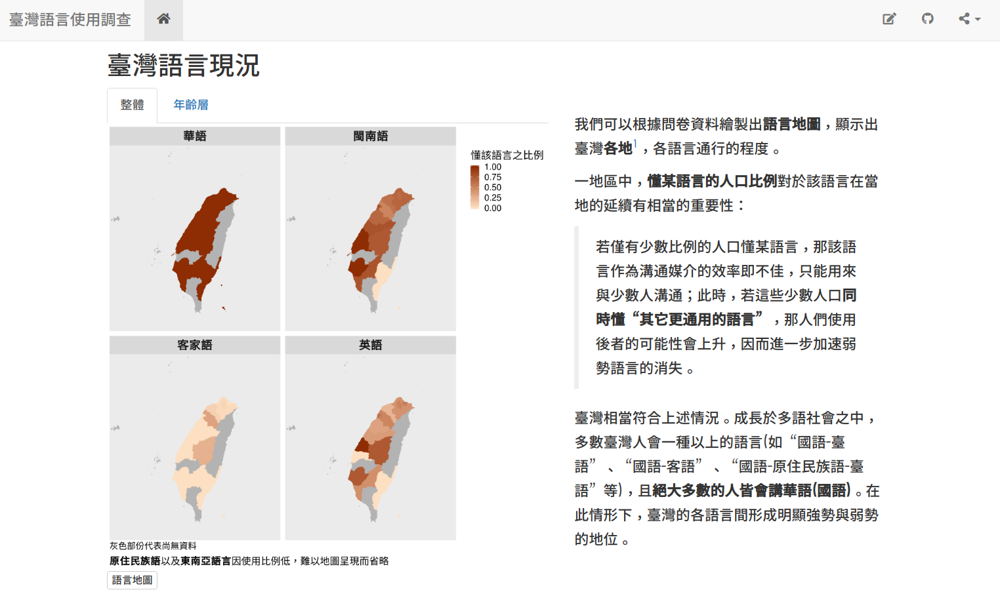
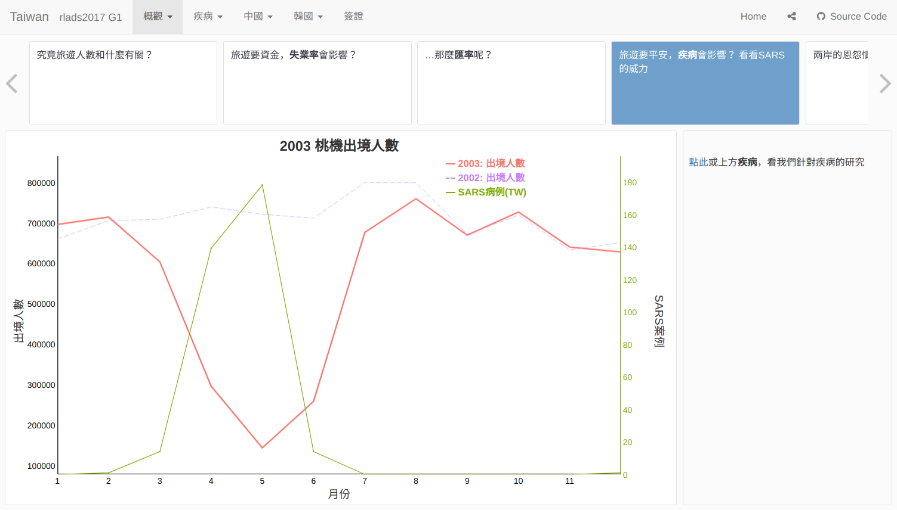

```{r fig.align='right', out.width='90%'}
include_graphics('img/creativity.png')
```

---

### 透過 R Markdown 分享至網路





.footnote[.smaller[
左：[twlangsurvey.github.io](https://twlangsurvey.github.io)

右：[rlads2017g1.github.io/presentation](https://rlads2017g1.github.io/presentation) 
]]