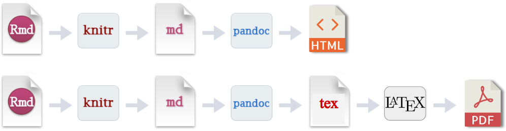

```{r setup, include=FALSE}
knitr::opts_chunk$set(echo = FALSE)
library(knitr)
```


class: inverse, center, middle

# 輸出 PDF 文件


???
接下來，要進入第一部份的最後一個主題，也就是用 R Markdown 輸出成 PDF 文件。

這個部份是今天的**大魔王**。

---

background-color: black
background-image: url("img/thanos.gif"), linear-gradient(to bottom, rgba(0,0,0, 1) 100%, rgba(0,0,0, 1) 100%)
background-size: contain, 100% 100%, cover

---

## 一條崎嶇的道路

.center[

]

???
那為什麼用 R Markdown 輸出 PDF 是大魔王呢？

大家可以看到這張 R Markdown 輸出文件的流程圖。上面那一排是 R Markdown 輸出 HTML 的過程。而下面那排是 R Markdown 輸出 PDF 的過程。

輸出 PDF 的過程，比起 HTML 多出了兩個兩個過程。而這兩個過程會造成輸出 PDF 非常容易出錯，因為過程中會使用到 LaTeX 這個工具。

前面有講到，LaTeX 是一個標記式語言。同時它也是一個用來將這種標記式語言生成 PDF 的工具。LaTeX 非常的複雜，而且它的要求非常嚴苛，所以在生成 PDF 的過程中常常會噴錯。

`--`

--

- 麻煩的中文字 (xelatex, 字體檔)

- 安裝 $\LaTeX$: 2018 之後的人生比較輕鬆 


???
再加上我們比較衰，我們寫的是中文不是英文。而中文字因為有編碼的問題，在用 R Markdown 輸出 PDF 之前，需要一些額外的步驟。

不過好事情是，去年有一個 R 套件叫做 `tinytex`，它的出現讓我們在 R Markdown 裡面輸出 PDF 變得容易很多。

那接下來，我們就一起走過這條崎嶇的道路。

---

## 安裝 tinytex (TinyTeX)

.pull-left[

#### **Windows 7/8/10**

1. 下載並解壓縮 TinyTeX:  
.s[[TinyTeX-win10.7z](https://www.space.ntu.edu.tw/navigate/s/58982B896253450A8BC2D87B26174229QQY) (72 MB) 或   
[TinyTeX-win10.zip](https://www.space.ntu.edu.tw/navigate/s/C8CCDD374E474DAC8DB8782B0A1B264CQQY) (108 MB)]

2. 
```r
install.packages('tinytex')
tinytex::use_tinytex()
```

3. 選取解壓縮後的 `TinyTeX` 資料夾<sup>＊</sup>

4. .s[(多試幾次)] 關閉再重新打開 RStudio，輸入

  ```r
  tinytex:::tinytex_root()
  #> if failed, i.e returning: [1] ""
  #> then try again
  ```
]

.footnote[.s[
[＊]: 解壓縮之後，如果有兩個 `TinyTeX` 資料夾，選擇**內層**的那個。
]]


.pull-right[

#### **Mac** .ms[or] 步驟 4. 失敗

1. 直接安裝 TinyTeX
  
  ```r
  install.packages('tinytex')
  tinytex::install_tinytex()
  ```

- 這種方式比較耗費時間

  - 參考 .s[[Using TinyTeX from a Flash Drive](https://yihui.name/en/2018/08/tinytex-flash-drive)] 打包 TinyTeX
.s[(左欄方式)]

]

???
我這邊先講投影片右邊，比較簡單，但是安裝過程中需要等待相當久的方式。如果你的電腦是 Mac 或是你比較不喜歡冒險的話，那你可以先用這種方式。

左邊那種方式，只有 Windows 的電腦可以使用。 那我只在 Windows 7 和 10 上測試過，所以並不保證一定能成功。當然失敗也沒關係，只要再用右邊那種方式就好。


### Mac

那右邊這種方式非常簡單，只要把那兩行指令複製貼上到你的 Rstudio 裡面就好。那過程中應該會跳出一些警告的視窗，那這些視窗並不會影響安裝，只要按確定就好。


### Windows 7/8/10

那左邊這種方式，大家需要先下載步驟 1 的壓縮檔。那如果你的電腦可以解壓縮 `.7z 壓縮檔` 就下載第一個，那如果不行就請下載 `.zip 檔`。

---

## 小心設定 .s[(因為中文字)]

.pull-left[

#### YAML Frontmatter

```yaml
title: "YAML for PDF Document"
author: "廖永賦\\thanks{作者資訊}"
documentclass: article
geometry: a4paper
linestretch: 1.35
links-as-notes: true
output:
  bookdown::pdf_document2:
*   latex_engine: xelatex
    number_sections: no
    toc: no
*   includes:
*     in_header: header.tex
```
]


???
這張投影片是給大家看看輸出中文 PDF 需要的額外步驟。

首先，在 R Markdown 的 YAML frontmatter 中，我們一定要加上黃色螢光標記的這 3 行，否則一定會出錯。

那大家可以看到最後一行有個 `header.tex` 的檔案，這個檔案就是額外設定 LaTeX 中文相關選項的地方。

`--`

--

.pull-right[
#### `header.tex`

```tex
*\usepackage{fontspec}
*\usepackage{xeCJK}
\usepackage{float}
\usepackage[fontsize=12pt]{scrextend}
\setlength{\parskip}{0.35cm}

*\setCJKmainfont{標楷體}
*\setCJKmonofont{Noto Sans Mono CJK TC}
*\XeTeXlinebreaklocale "zh"
*\XeTeXlinebreakskip = 0pt plus 1pt

\renewcommand{\figurename}{圖}
\renewcommand{\tablename}{表}
\renewcommand{\contentsname}{目錄}
\renewcommand{\listfigurename}{圖目錄}
\renewcommand{\listtablename}{表目錄}
\renewcommand{\appendixname}{附錄}
\renewcommand{\abstractname}{摘要}

\renewcommand{\textfraction}{0.05}
\renewcommand{\topfraction}{0.8}
\renewcommand{\bottomfraction}{0.8}
\renewcommand{\floatpagefraction}{0.75}
```
]


???
右邊這個就是部份 `header.tex` 的內容。那大家不用擔心，這裡可以不用去管它。那告訴大家這個東西，只是讓大家知道有時候，如果你想要輸出的 PDF 有特定的外觀，必須要去修改 `header.tex` 的內容。

---

## 更簡單的方式：.s[R Markdown .s[模板]]

.pull-left[
#### 1. 安裝 `rmdtk`

```r
install.packages('remotes')
remotes::install_github('liao961120/rmdtk')
rmdtk::download_fonts()
```

#### 2. 匯入模板


- 指令

  ```r
  rmarkdown::draft('my_new_doc', template = 'CJKdocument', package = 'rmdtk')
  ```


- RStuido GUI .ms[(見右)]:
  
  .ms[File → New File → R Markdown → From Template →  
  **Portable CJK Document for HTML & PDF**] 

]


???
那事實上，RStudio 提供了一個方常方便的功能。你可以透過 Rstudio 匯入 R Markdown 的模板。那這些模板是由 R 套件所提供的。

為了減少我自己以及大家在設定時的麻煩，我快速寫了一個 R Markdown 模板。這個模板幫使用者預先設定好了一些選項，也幫使用者解決 LaTeX 常會遇到的字體問題。所以基本上，你只要下載這個模板之後，就可以直接將 R Markdown 輸出成 PDF，而不用擔心額外的設定。


(記得提醒：能同時輸出 **2 種**格式)  
那我這邊示範一次給大家看看

---

background-image: linear-gradient(to bottom, rgba(255,255,255,0.4) 0%, rgba(255,255,255,0.4) 100%), url("https://bit.ly/2VCakjd")
background-position: center
background-size: contain, 100% 100%, cover


.footnote[
.ml[.ml[
**接著就可以  `.Rmd` 了**]]
]