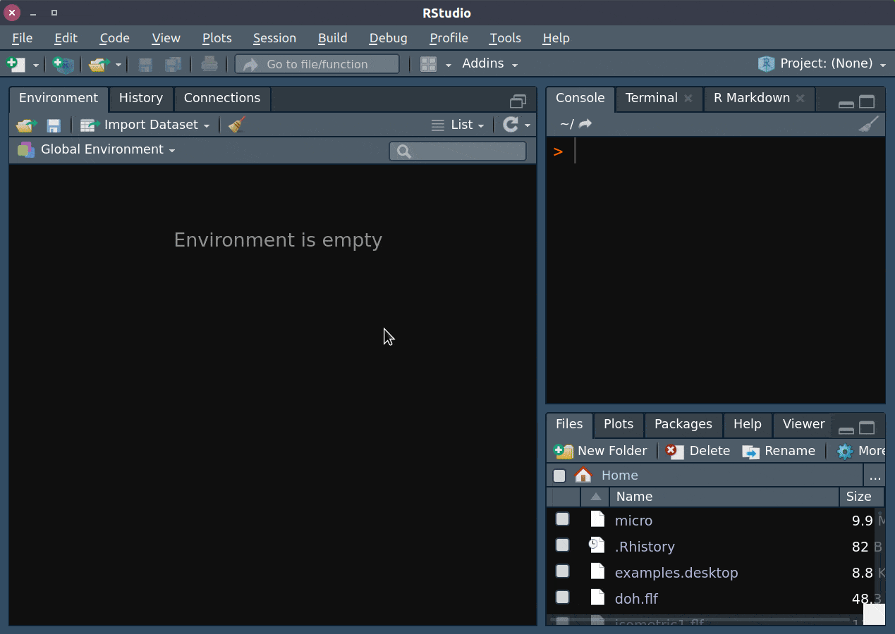

```{r setup, include=FALSE}
knitr::opts_chunk$set(echo = FALSE)
library(knitr)
```


class: inverse, center, middle

# 輸出 PDF 文件

---

background-color: black
background-image: url("img/thanos.gif"), linear-gradient(to bottom, rgba(0,0,0, 1) 100%, rgba(0,0,0, 1) 100%)
background-size: contain, 100% 100%, cover

---

## 一條崎嶇的道路

.center[

]

- 安裝 $\LaTeX$

- 麻煩的中文字 (xelatex, 字體檔)

--

- 2018 之後的人生比較輕鬆 


---

## 安裝 tinytex (TinyTeX)

.pull-left[

1. .s[(**Windows 7/10**)] 下載並解壓縮 TinyTeX:  
.s[[TinyTeX-win10.7z](http://bit.ly/TinyTeX-win10-7z) (72 MB) 或   
[TinyTeX-win10.zip](http://bit.ly/TinyTeX-win10-zip) (108 MB)]

2. 
```r
install.packages('tinytex')
tinytex::use_tinytex()
```

3. 選取解壓縮後的 `TinyTeX` 資料夾<sup>＊</sup>

4. .s[(多試幾次)] 關閉再重新打開 RStudio，輸入

  ```r
  tinytex:::tinytex_root()
  #> if failed, i.e returning: [1] ""
  #> then try again
  ```
]

.footnote[.s[
[＊]: 解壓縮之後，如果有兩個 `TinyTeX` 資料夾，選擇**內層**的那個。
]]

--

.pull-right[
1. .s[(**Mac** .ms[or] 步驟 4. 失敗)] 直接安裝 TinyTeX
  
  ```r
  install.packages('tinytex')
  tinytex::install_tinytex()
  ```

- 這種方式比較耗費時間

  - 參考 .s[[Using TinyTeX from a Flash Drive](https://yihui.name/en/2018/08/tinytex-flash-drive)] 打包 TinyTeX
.s[(左欄方式)]

]

???
如果不想每次用新電腦都重新安裝一次，可以參考這篇文章，說明將 TinyTeX 儲存於隨身碟

---

## 小心設定 .s[(因為中文字)]

.pull-left[

#### YAML Frontmatter

```yaml
title: "YAML for PDF Document"
author: "廖永賦\\thanks{作者資訊}"
documentclass: article
geometry: a4paper
linestretch: 1.35
links-as-notes: true
output:
  bookdown::pdf_document2:
*   latex_engine: xelatex
    number_sections: no
    toc: no
*   includes:
*     in_header: header.tex
```
]

--

.pull-right[
#### `header.tex`

```tex
*\usepackage{fontspec}
*\usepackage{xeCJK}
\usepackage{float}
\usepackage[fontsize=12pt]{scrextend}
\setlength{\parskip}{0.35cm}

*\setCJKmainfont{標楷體}
*\setCJKmonofont{Noto Sans Mono CJK TC}
*\XeTeXlinebreaklocale "zh"
*\XeTeXlinebreakskip = 0pt plus 1pt

\renewcommand{\figurename}{圖}
\renewcommand{\tablename}{表}
\renewcommand{\contentsname}{目錄}
\renewcommand{\listfigurename}{圖目錄}
\renewcommand{\listtablename}{表目錄}
\renewcommand{\appendixname}{附錄}
\renewcommand{\abstractname}{摘要}

\renewcommand{\textfraction}{0.05}
\renewcommand{\topfraction}{0.8}
\renewcommand{\bottomfraction}{0.8}
\renewcommand{\floatpagefraction}{0.75}
```
]

---

## 更簡單的方式：.s[R Markdown .s[模板]]

.pull-left[
#### 1. 安裝 `rmdtk`

```r
install.packages('remotes')
remotes::install_github('liao961120/rmdtk')
rmdtk::download_fonts()
```

#### 2. 匯入模板


##### 指令
```r
rmarkdown::draft('my_new_doc',
  template = 'CJKdocument', package = 'rmdtk')
```


##### RStuido GUI .ms[(見右)]:

.ms[File → New File → R Markdown → From Template → **Portable CJK Document for HTML & PDF**] 

]



---

background-image: linear-gradient(to bottom, rgba(255,255,255,0.4) 0%, rgba(255,255,255,0.4) 100%), url("https://bit.ly/2VCakjd")
background-position: center
background-size: contain, 100% 100%, cover


.footnote[
.ml[.ml[
**接著就可以  `.Rmd` 了**]]
]