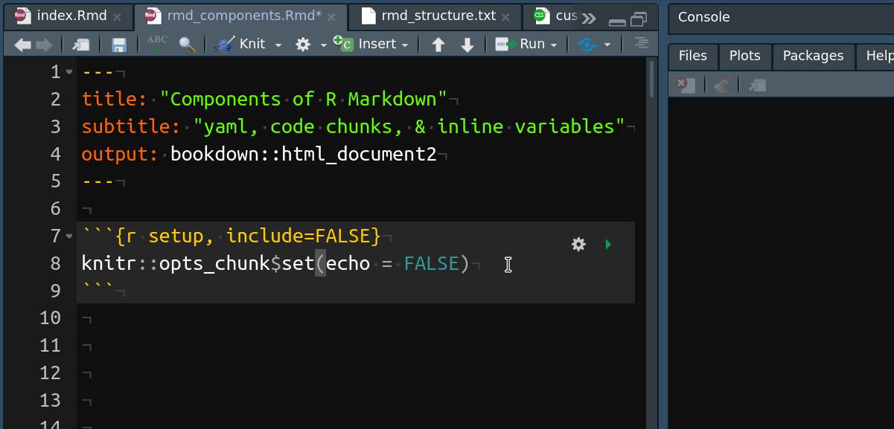

```{r setup, include=FALSE}
knitr::opts_chunk$set(
	echo = FALSE,
	message = FALSE,
	warning = FALSE
)
library(knitr)
knitr_ico <- ""
```


class: inverse, center, middle

# Components of R Markdown

---

## What is R Markdown?


.center[.much-larger[
<code>
R Markdown = knit**.r[r]**  +  Pandoc **.r[Markdown]**
</code>
]]

--

<br>

.larger[
- **`knitr`**: A tool for embedding R code & execution results into a Markdown document.

- **`Pandoc`**: A Tool for conversion between multiple document formats.
]
---

## Pandoc Markdown: 解決「紙本 vs. 網頁」的衝突


|          | 所見即所得                                     | 所見即所思                       |
|----------|------------------------------------------------|----------------------------------|
| **紙本** | MS Word                                        | $\LaTeX$,<br>Markdown (近年目標)  |
| **網頁** | 部落格文章撰寫後台<br>(e.g. WordPress, Medium) | HTML,<br>Markdown (初創目的) |

.footnote[
[pandoc.org/try](https://pandoc.org/try/)
]

---

## Structure of an R Markdown Document

```{r}
rmd_structure <- c('````md', readLines('rmd_structure.txt'), '````')
rmd_structure1 <- rmd_structure
rmd_structure2 <- rmd_structure
rmd_structuremd <- rmd_structure

# Highlight yaml & code chunk
rmd_structure1[2:6] <- paste0('*', rmd_structure1[2:6])
rmd_structure2[c(12:15,20)] <- paste0('*', rmd_structure2[c(12:15,20)])
rmd_structuremd[c(8:10, 17:19)] <- paste0('*', rmd_structuremd[c(8:10, 17:19)])

toprint <- function(x) paste(x, collapse = '\n')
rmd_structure <- toprint(rmd_structure)
rmd_structure1 <- toprint(rmd_structure1)
rmd_structure2 <- toprint(rmd_structure2)
rmd_structuremd <- toprint(rmd_structuremd)
```

.left-column[
### Whole Document
]

.right-column[
`r asis_output(rmd_structure)`
]


---

## Structure of an R Markdown Document

.left-column[
### Whole Document
### .little-smaller[YAML Frontmatter<br>(metadata)]
]

.right-column[
`r asis_output(rmd_structure1)`
]

---

## Structure of an R Markdown Document

.left-column[
### Whole Document
### .little-smaller[YAML Frontmatter<br>(metadata)]
### Markdown
]

.right-column[
`r asis_output(rmd_structuremd)`
]

---

## Structure of an R Markdown Document

.left-column[
### Whole Document
### .little-smaller[YAML Frontmatter<br>(metadata)]
### Markdown
### .little-smaller[knitr Code Chunks<br>(Executable)]
]

.right-column[
`r asis_output(rmd_structure2)`
]

---

```{r}
md_code_chunk <- c('````Rmd', '*```r', 'print("This will NOT be printed!")', '```', '````')
md_code_chunk <- toprint(md_code_chunk)

rmd_code_chunk <- c('````Rmd', '*```{r}', 'print("This will be printed!")', '```', '````')
rmd_code_chunk <- toprint(rmd_code_chunk)
```

## 3 種 Code Chunks

1. Markdown (不會執行)
  `r md_code_chunk`

1. knitr Code Chunk (Executable)
  `r rmd_code_chunk`

1. Inline R Code Chunk (Executable)

  <code class='hljs Rmd'>
  &#96;r "This will be printed!"&#96;
  </code>


---

## knitr Code Chunk

.left-column[
### Chunk Options
]

.right-column[

```{r}
rmd_code_chunk <- c('````Rmd', '```{r chunk-label, echo=FALSE, dev="png"}', 'x <- 1 + 1', '```', '````')
rmd_code_chunk <- toprint(rmd_code_chunk)
```

`r rmd_code_chunk`

- `echo`: show R source code?

- `eval`: Run code chunk?

- `include`: include the chunk output in the final output document?

- `out.width='90%'`: 輸出圖片佔 90% 頁面寬度

]

.footnote[.little-larger[
[`knitr` 說明文件](https://yihui.name/knitr/options/)
]]

---

## knitr Code Chunk

.left-column[
### Chunk Options
]

.right-column[

```{r}
chunk_opts <- 'knitr::opts_chunk$set(echo = FALSE)'
rmd_code_chunk <- c('````Rmd', '```{r setup, include=FALSE}', chunk_opts, '```', '````')
rmd_code_chunk <- toprint(rmd_code_chunk)
```

#### Global Chunk options

`r rmd_code_chunk`
      
```{r out.width='95%'}

```

]

---

## knitr Code Chunk

.left-column[
### Chunk Options
### .little-smaller[例: 統計圖]
]

.right-column[

輸出**統計圖**，並

1. 隱藏原始碼: `echo=FALSE`
1. 調整圖片寬度：`out.width="35%"`
1. 調整圖片比例 (寬:高 = 6:4)：`fig.dim=c(6, 4)`

```{r}
code <- c('library(ggplot2)',
          'ggplot(data = iris) +',
          '  geom_point(aes(Sepal.Length, Petal.Width, color = Species))')
rmd_code_chunk <- c('````Rmd',
                    '```{r iris-plot, echo=FALSE, out.width="35%", fig.dim=c(6, 4)}', code,
                    '```', '````')
rmd_code_chunk <- toprint(rmd_code_chunk)
```

`r rmd_code_chunk`

**Output:**

```{r out.width="35%", fig.dim=c(6, 4)}
library(ggplot2)
ggplot(data = iris) +
  geom_point(aes(Sepal.Length, Petal.Width,
                 color = Species))
```

]

---

## knitr Code Chunk

.left-column[
### Chunk Options
### .little-smaller[例: 統計圖]
### .little-smaller[例: 表格]
]

.right-column[
將 `data.frame` 輸出成**表格**

```{r}
code <- c('data <- iris[1:5, 1:3]',
          'knitr::kable(data, align = "c", format = "markdown",',
          '             caption = "表格說明文字"')
rmd_code_chunk <- c('````Rmd',
                    '```{r echo=FALSE}', code,
                    '```', '````')
rmd_code_chunk <- toprint(rmd_code_chunk)
```

`r rmd_code_chunk`

**Output:**

```{r}
data <- iris[1:5, 1:3]
knitr::kable(data, align = 'c', format = 'markdown',
             caption = '表格說明文字')
```

]


---

## knitr Code Chunk

.left-column[
### Chunk Options
### .little-smaller[例: 統計圖]
### .little-smaller[例: 表格]
### .little-smaller[例: 外部圖片]
]

.right-column[

使用**外部**，而非 R 所產生之圖片


```{r}
code <- ''
rmd_code_chunk <- c('````Rmd',
                    '```{r world, echo=TRUE, out.width="40%", fig.cap="圖片說明文字"}',
                    code,
                    '```', '````')
rmd_code_chunk <- toprint(rmd_code_chunk)
```

`r rmd_code_chunk`

**Output:**

```{r world, echo=TRUE, out.width='40%', fig.cap='圖片說明文字'}

```


]


---

## knitr Code Chunk

.left-column[
### Chunk Options
### .little-smaller[例: 統計圖]
### .little-smaller[例: 表格]
### .little-smaller[例: 外部圖片]
]

.right-column[

#### .larger[相對路徑 vs. 絕對路徑]

- Current Working Directory：**`.Rmd` 所在的資料夾**

- **盡量使用相對路徑**：外部檔案路徑都是.r[**相對 `.Rmd` 而言**]

    ```yml
    slide.Rmd 所在之資料夾/
    │
    ├── slide.Rmd
    └── img/
    *    └── world_night.jpg
    ```

```r
            # Good

include_graphics('img\\world_night.jpg')           # Bad !!!
include_graphics('C:/.../img/world_night.jpg')     # Bad !!!
include_graphics('C:\\...\\img\\world_night.jpg')  # Worst !!!
```
]

???
Windows 的檔案路徑是用反斜線 (`\`) 表示分隔，但所有非 Windows 的電腦是用正斜線表示。在 R 當中使用正協線表示路徑能在所有作業系統下運行。

---

## knitr Code Chunk

.left-column[
### Chunk Options
### .little-smaller[例: 統計圖]
### .little-smaller[例: 表格]
### .little-smaller[例: 外部圖片]
### Your Turn
]

.right-column[

#### .larger[練習時間]

1. 下載 [`code_chunk_prac.zip`](https://liao961120.github.io/2019-fju-rmd-talk/code_chunk_prac.zip)

1. 修改 `code_chunk_prac.Rmd` 中的內容，  
使輸出<sup>\*</sup>結果與[此網頁](https://bit.ly/2FUQPvP)相同

1. 參考答案寫在 `code_chunk_prac_solu.Rmd`

]


.footnote[
[\*]: 以 RStudio 開啟 `.Rmd` ➜ 點擊 `r knitr_ico` (`Knit`)
]
---

## YAML Frontmatter

.pull-left[
#### Pandoc 模板變項
    
```yml
title: 'A title'
date: 'r Sys.Date()'
author: 'Somebody'
bibliography: ref.bib
csl: apa.csl
```

<br>

- 不同輸出格式 (模板)，可供設定之變項不盡相同
    - `geometry`, `linestretch` 僅對於 PDF 輸出的文件有效果

- 可用**動態變項** (inline R Code) 作為輸入
    - 今天是 &#96;<code>r Sys.Date()</code>&#96;  
    今天是 `r Sys.Date()`
]

.pull-right[
#### 輸出格式
    
```yml
output:
  bookdown::html_document2:
    toc: yes
    number_sections: no
  bookdown::pdf_document2:
    toc: yes
    number_sections: no
```

<br>

- **.r[縮排]**結構必須一致: 每層皆使用 **2 格空白**

- 可同時設定多個輸出格式
]

---

## YAML 好複雜？

.center[.larger[
沒錯，不要去記它，.r[**複製貼上就好**]
]]

<br>

- 輸出 HTML 文件 ([檢視](https://github.com/liao961120/2019-fju-rmd-talk/blob/master/minimal_html), [下載](https://minhaskamal.github.io/DownGit/#/home?url=https://github.com/liao961120/2019-fju-rmd-talk/tree/master/minimal_html))

- 輸出 PDF 文件 ([檢視](https://github.com/liao961120/2019-fju-rmd-talk/tree/master/minimal_pdf), [下載](https://liao961120.github.io/2019-fju-rmd-talk/minimal_pdf.zip))

