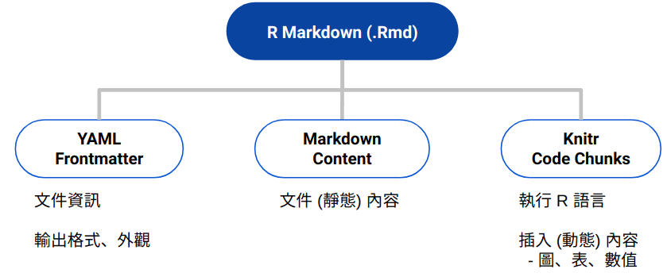
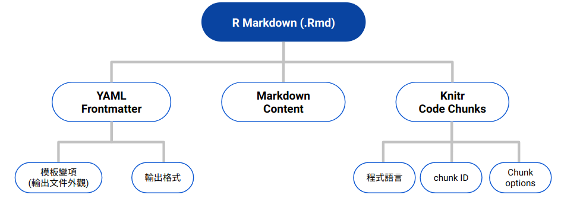
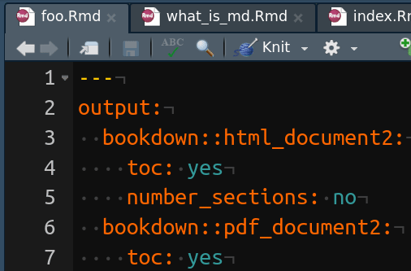

```{r setup, include=FALSE}
knitr::opts_chunk$set(
	echo = FALSE,
	message = FALSE,
	warning = FALSE
)
library(knitr)
knitr_ico <- ""
```


class: inverse, center, middle

# Components of R Markdown

???
介紹完 Markdown 之後，接著就要正式進入 R Markdown 的介紹了。

---

## What is R Markdown?


.center[.much-larger[
<code>
R Markdown = knit**.r[r]**  +  Pandoc **.r[Markdown]**
</code>
]]

- **`knitr`**: A tool for embedding R code & execution results into a Markdown document.

???
R Markdown 顧名思義就是 R 加上 Markdown。  
更精確的說，這邊 R 指的是 knitr 這個套件。knitr 這個套件讓「可以被執行的 R 語言」能夠直接嵌入在 Markdown 文件當中，讓每次輸出文件時，R 語言執行的結果，像是圖表或數值，能自動的被插入文件中。

--

<br>

.ml[**結合「寫作」與「分析」**]

.pull-left[
#### 傳統流程

1. 統計分析 → SPSS, SAS, Excel

1. 報告撰寫 → Word

1. .s[啊！我發現統計分析時，用錯資料了...  
→ .r[重複步驟 1, 2]]

1. 輸出報告
]

.pull-right[
#### R Markdown 流程

1. 統計分析 + 報告撰寫 → R Markdown

1. .s[啊！我發現統計分析時，用錯資料了...  
→ .r[修改資料輸入指令]]

1. 輸出報告
]

???
這讓 R Markdown 可以結合「分析」和「寫作」這兩種「原本在傳統統計報告準備流程中是分開」的兩件事。

傳統的報告準備流程中，我們必須先在統計軟體裡面跑出分析結果，再手動的將這些結果複製進 Word 裡。  
那這邊會造成一個問題是，如果我們在報告寫到一半的時候，發現我們之前分析階段出了問題，那我們就必須重新跑一次統計再手動將新的圖表和數值更新在 Word 中。

但如果使用 R Markdown，因為統計分析的結果是自動插入文件的，我們只需要修改造成分析錯誤的 R 指令就好，並不需要再額外更新文件內容。

---

## Structure of an R Markdown Document

<br>

.center[]

---

## Structure of an R Markdown Document

<br>

.center[]

---

## Structure of an R Markdown Document

```{r}
rmd_structure <- c('````md', readLines('rmd_structure.txt'), '````')
rmd_structure1 <- rmd_structure
rmd_structure2 <- rmd_structure
rmd_structuremd <- rmd_structure

# Highlight yaml & code chunk
rmd_structure1[2:6] <- paste0('*', rmd_structure1[2:6])
rmd_structure2[c(12:15,20)] <- paste0('*', rmd_structure2[c(12:15,20)])
rmd_structuremd[c(8:10, 17:19)] <- paste0('*', rmd_structuremd[c(8:10, 17:19)])

toprint <- function(x) paste(x, collapse = '\n')
rmd_structure <- toprint(rmd_structure)
rmd_structure1 <- toprint(rmd_structure1)
rmd_structure2 <- toprint(rmd_structure2)
rmd_structuremd <- toprint(rmd_structuremd)
```


.left-column[
### .little-smaller[YAML Frontmatter<br>(Metadata)]
]

.right-column[
`r asis_output(rmd_structure1)`
]

???
一份 R Markdown 文件是由 3 個部份所組成的。這邊大家看到的就是一份完整的 R Markdown 文件的內容。

文件的最上方叫做 YAML frontmatter。這邊主要是控制 R Markdown 輸出文件的樣式以及外觀的一些設定。

---

## Structure of an R Markdown Document

.left-column[
### .little-smaller[YAML Frontmatter<br>(Metadata)]
### Markdown <br>.ls[(Static Content)]
]

.right-column[
`r asis_output(rmd_structuremd)`
]

???
第二個部份則是用 Markdown 撰寫的文件內容。

---

## Structure of an R Markdown Document

.left-column[
### .little-smaller[YAML Frontmatter<br>(Metadata)]
### Markdown <br>.ls[(Static Content)]
### .little-smaller[knitr Code Chunks<br>(Executable)]
]

.right-column[
```{r}
doc_vec <- readLines('rmd_structure.txt')
first_line <- paste0('<pre><code class="md hljs markdown remark-code">', doc_vec[1])
rmd_structure <- c(first_line, doc_vec[-1], '</code></pre>')

rmd_structure[11:14] <- paste0('<div class="remark-code-line remark-code-line-highlighted">', rmd_structure[11:14], '</div>')
rmd_structure[16] <- paste0('<div class="remark-code-line"><span class="hljs-section">',
                            rmd_structure[16], '</span></div>')
rmd_structure[18] <- '<div class="remark-code-line">Variables computed in code chunks can be placed inline: <span class="remark-code-span-highlighted">`r today`</span></div>'

rmd_structure <- toprint(rmd_structure)
```

`r asis_output(rmd_structure)`
]

???
第三個部份就是 R Markdown 插入可執行之 R 語言的部份。要在 R Markdown 裡面插入這種內容，可以使用兩種方式。

第一種是右邊比較暗的黃色螢光標記的部份，這邊的語法與 Markdown 的 code chunk 語法類似，但與 Markdown 不同的是，這些 code chunk 在 3 個反引號之後，使用大括號將 r 包覆起來。

第二種語法則是用來將 R 計算出來的數值直接插入在一行當中的某處。

---

```{r}
md_code_chunk <- c('````Rmd', '*```r', 'print("This will NOT be printed!")', '```', '````')
md_code_chunk <- toprint(md_code_chunk)

rmd_code_chunk <- c('````Rmd', '*```{r}', 'print("This will be printed!")', '```', '````')
rmd_code_chunk2 <- c('````Rmd', '```{r}', 'ttest <- t.test(1:10, y = c(7:20))', 'pval <- ttest[["p.value"]]', '```', '````')
rmd_code_chunk <- toprint(rmd_code_chunk)
rmd_code_chunk2 <- toprint(rmd_code_chunk2)
```

## 3 種 Code Chunks

1. Markdown (不會執行)
  `r md_code_chunk`

1. knitr Code Chunk (Executable)
  `r rmd_code_chunk`

1. Inline R Code Chunk (Executable)
  
  `r rmd_code_chunk2`
  
  <code class='hljs'>
  T 檢定所得之 p 值為 &#96;r pval&#96;
  </code>


???
所以，R Markdown 其實有 3 種 Code chunk。

第一種就是剛剛提到的 Markdown 的 code chunk。這種 code chunk 就是 Markdown 語法的一部分，它本身並不會執行，多半是用來 highlight 文件當中的程式碼語法

第二種就是類似 Markdown code chunk 但可以執行的程式碼區塊。這種 code chunk 會是 R Markdown 裡面最常出現的一種，也會是等一下介紹的重點。那我之後就把這種 code chunk 叫做 knitr code chunk。

第三種是用來在行內插入數值的語法。這種 code chunk 很實用。舉例來說，你可以在前面的 code chunk 先計算出統計檢定的 p-value ，並將這個 p-value 儲存在某個變項裡面，然後再用這個語法將 p-value 插入 Markdown 內文中的某處。

---

## knitr Code Chunk

.left-column[
### Chunk Options
]

.right-column[

```{r}
rmd_code_chunk <- c('````Rmd', '```{r chunk-label, echo=FALSE, dev="png"}', 'x <- 1 + 1', '```', '````')
rmd_code_chunk <- toprint(rmd_code_chunk)
```

`r rmd_code_chunk`

- `echo`: show R source code?

- `eval`: Run code chunk?

- `include`: include the chunk output in the final output document?

- `out.width='90%'`: 輸出圖片佔 90% 頁面寬度

]

.footnote[.little-larger[
[`knitr` 說明文件](https://yihui.name/knitr/options/)
]]


???
knitr code chunk 有一個很重要的特徵是，它可以有許多選項可以進行設定。例如，你有時候想讓讀者看到跑出結果的程式碼但有時候不想，這時候，你就可以透過 knitr 的 chunk options 進行這些設定。

那這些選項是設定在 knitr code chunk 第一行的大括弧之內。那這大括弧之內的結構大致是這樣：

(手動反白操作)
第一個 r 標明這個 code chunk 是個 R code chunk。  
那事實上，除了 R 你也可以把它換成其它程式語言，例如 Python 和 bash。那前提是你的電腦已有安裝這些程式語言。

第二個出現的是這個 code chunk 的 ID，那這個 ID 是 optional 的，可以不用寫。

code chunk ID 之後出現的一律都是 knitr 的 code chunk options。這些 options 之間以逗點分隔。

我這邊列出了幾個最常用的 knitr chunk options。至於完整的選項，大家可以在下方的 knitr 說明文件裡面看到。

---

## knitr Code Chunk

.left-column[
### Chunk Options
]

.right-column[

```{r}
chunk_opts <- 'knitr::opts_chunk$set(echo = FALSE)'
rmd_code_chunk <- c('````Rmd', '```{r setup, include=FALSE}', chunk_opts, '```', '````')
rmd_code_chunk <- toprint(rmd_code_chunk)
```

#### Global Chunk options

`r rmd_code_chunk`
      
```{r out.width='95%'}
include_graphics('img/global_chunk_opts.gif')
```

]

???
那有時後，你不想每次都為新的 code chunk 重複設定一樣的選項。這個時候，你就可以用 global chunk option 去設定。

global chunk option 通常是在 R Markdown 裡面的第一個 code chunk 進行設定。RStudio 也提供了方便的圖形化界面，讓你不用去記下這語法也能進行設定。

---

## knitr Code Chunk

.left-column[
### Chunk Options
### .little-smaller[例: 統計圖]
]

.right-column[

輸出**統計圖**，並

1. 隱藏原始碼: `echo=FALSE`
1. 調整圖片寬度：`out.width="35%"`
1. 調整圖片比例 (寬:高 = 6:4)：`fig.dim=c(6, 4)`

```{r}
code <- c('library(ggplot2)',
          'ggplot(data = iris) +',
          '  geom_point(aes(Sepal.Length, Petal.Width, color = Species))')
rmd_code_chunk <- c('````Rmd',
                    '```{r iris-plot, echo=FALSE, out.width="35%", fig.dim=c(7, 3.5)}', code,
                    '```', '````')
rmd_code_chunk <- toprint(rmd_code_chunk)
```

`r rmd_code_chunk`
]

--

.right-column[
**Output:**

```{r out.width="35%", fig.dim=c(7, 3.5)}
library(ggplot2)
ggplot(data = iris) +
  geom_point(aes(Sepal.Length, Petal.Width,
                 color = Species))
```
]

---

## knitr Code Chunk

.left-column[
### Chunk Options
### .little-smaller[例: 統計圖]
### .little-smaller[例: 表格]
]

.right-column[
將 `data.frame` 輸出成**表格**

```{r}
code <- c('data <- iris[1:4, 1:3]',
          'knitr::kable(data, align = "c", caption = "表格說明文字")')
rmd_code_chunk <- c('````Rmd',
                    '```{r echo=FALSE}', code,
                    '```', '````')
rmd_code_chunk <- toprint(rmd_code_chunk)
```

`r rmd_code_chunk`
]

--

.right-column[
**Output:**

```{r}
data <- iris[1:4, 1:3]
knitr::kable(data, align = 'c', format = 'html',
             caption = '表格說明文字')
```

]


---

## knitr Code Chunk

.left-column[
### Chunk Options
### .little-smaller[例: 統計圖]
### .little-smaller[例: 表格]
### .little-smaller[例: 外部圖片]
]

.right-column[

使用**外部**，而非 R 所產生之圖片


```{r}
code <- 'knitr::include_graphics("img/world_night.jpg")'
rmd_code_chunk <- c('````Rmd',
                    '```{r world, echo=TRUE, out.width="38%", fig.cap="圖片說明文字"}',
                    code,
                    '```', '````')
rmd_code_chunk <- toprint(rmd_code_chunk)
```

`r rmd_code_chunk`
]

--

.right-column[
**Output:**

```{r world, echo=TRUE, out.width='38%', fig.cap='圖片說明文字'}
knitr::include_graphics('img/world_night.jpg')
```

]

---

## knitr Code Chunk

.left-column[
### Chunk Options
### .little-smaller[例: 統計圖]
### .little-smaller[例: 表格]
### .little-smaller[例: 外部圖片]
]

.right-column[

#### .larger[相對路徑 vs. 絕對路徑]

- Current Working Directory：**`.Rmd` 所在的資料夾**

- **盡量使用相對路徑**：外部檔案路徑都是.r[**相對 `.Rmd` 而言**]

    ```yml
    slide.Rmd 所在之資料夾/
    │
    ├── slide.Rmd
    └── img/
    *    └── world_night.jpg
    ```

```r
include_graphics('img/world_night.jpg')            # Good

include_graphics('img\\world_night.jpg')           # Bad !!!
include_graphics('C:/.../img/world_night.jpg')     # Bad !!!
include_graphics('C:\\...\\img\\world_night.jpg')  # Worst !!!
```
]

???
Windows 的檔案路徑是用反斜線 (`\`) 表示分隔，但所有非 Windows 的電腦是用正斜線表示。在 R 當中使用正協線表示路徑能在所有作業系統下運行。

---

## knitr Code Chunk

.left-column[
### Chunk Options
### .little-smaller[例: 統計圖]
### .little-smaller[例: 表格]
### .little-smaller[例: 外部圖片]
### Your Turn
]

.right-column[

#### .larger[練習時間]

1. 下載 [`code_chunk_prac.zip`](https://liao961120.github.io/2019-fju-rmd-talk/code_chunk_prac.zip)

1. 修改 `code_chunk_prac.Rmd` 中的內容，  
使輸出<sup>\*</sup>結果與[此網頁](https://bit.ly/2FUQPvP)相同

1. 參考答案寫在 `code_chunk_prac_solu.Rmd`

]


.footnote[
[\*]: 以 RStudio 開啟 `.Rmd` ➜ 點擊 `r knitr_ico` (`Knit`) or  
`rmarkdown::render('path/to/code_chunk_prac.Rmd')`
]
---

## YAML Frontmatter

.pull-left[
#### Pandoc 模板變項

```{r}
str <- '`r Sys.Date()`'
```


```yml
title: 'A title'
date: '`r str`'  # ➛ '`r Sys.Date()`'
author: 'Somebody'
bibliography: ref.bib
csl: apa.csl
```

<br>

- 不同格式 (模板)，可供設定之變項不盡相同
    - `geometry`, `linestretch` 僅對於 PDF 輸出的文件有效果

- 可用**動態變項** (inline R Code) 作為輸入
    - 今天是 &#96;<code>r Sys.Date()</code>&#96;  
    今天是 `r Sys.Date()`
]

--

.pull-right[
#### 輸出格式
    
```yml
output:
  bookdown::html_document2:
    toc: yes
    number_sections: no
  bookdown::pdf_document2:
    toc: yes
    number_sections: no
```


- **.r[縮排]**結構必須一致: 每層皆使用 **2 格空白**

- 可同時設定多個輸出格式  



]

---

## YAML 好複雜？

.center[.larger[
沒錯，不要去記它，.r[**複製貼上就好**]
]]

<br>

- 輸出 HTML 文件 ([檢視](https://github.com/liao961120/2019-fju-rmd-talk/blob/master/minimal_html), [下載](https://minhaskamal.github.io/DownGit/#/home?url=https://github.com/liao961120/2019-fju-rmd-talk/tree/master/minimal_html))

- 輸出 PDF 文件 ([檢視](https://github.com/liao961120/2019-fju-rmd-talk/tree/master/minimal_pdf), [下載](https://liao961120.github.io/2019-fju-rmd-talk/minimal_pdf.zip))

