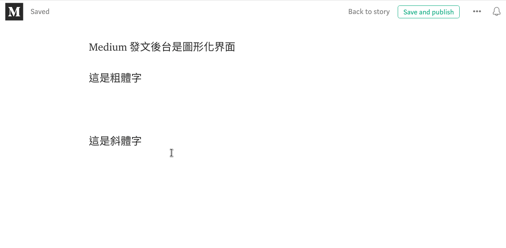
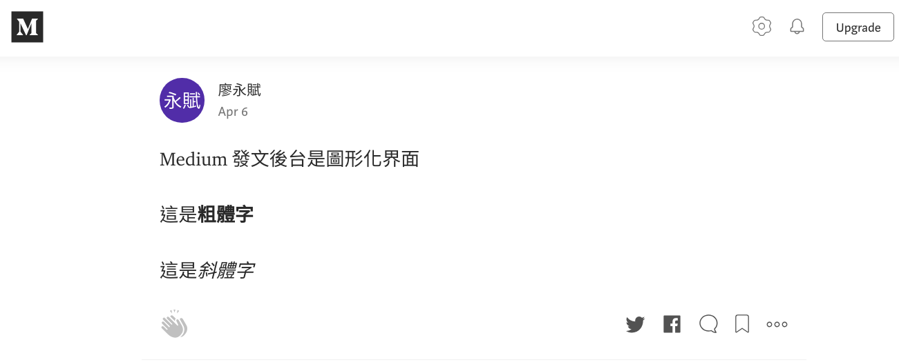
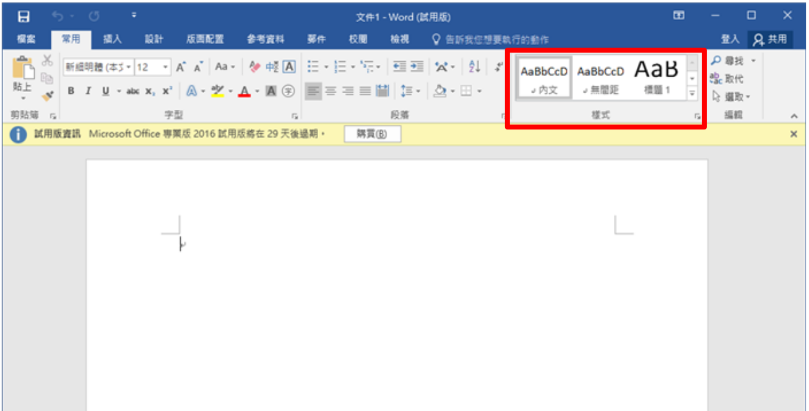
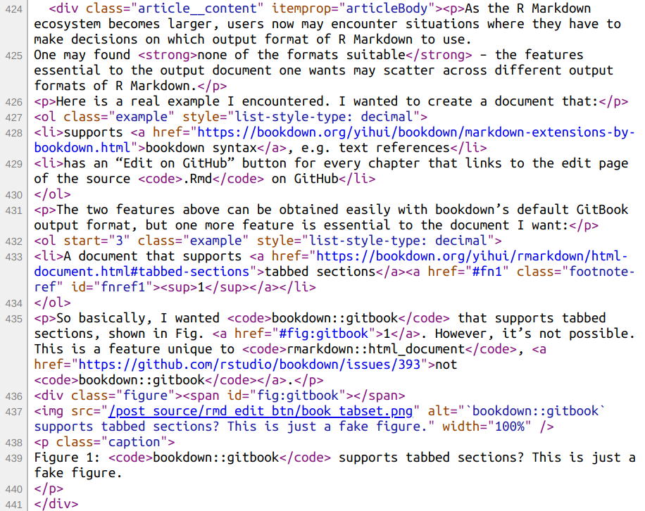
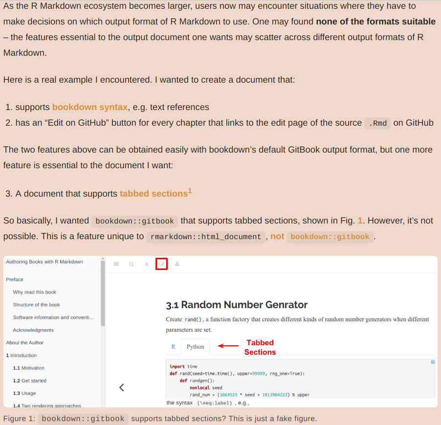
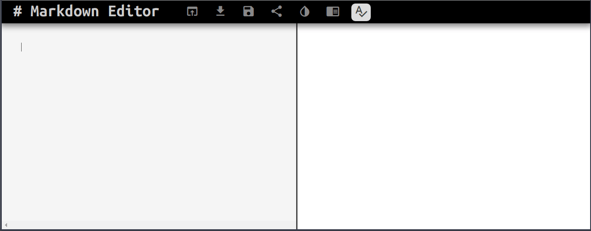
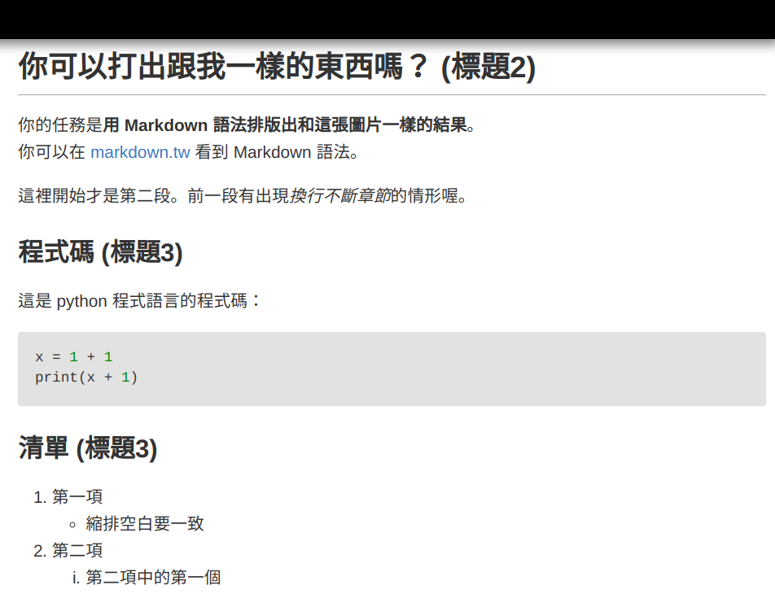

```{r setup, include=FALSE}
knitr::opts_chunk$set(echo = FALSE)
library(knitr)
```


class: inverse, center, middle

# What is Markdown?

???
所以 R Markdown 是什麼？基本上，R Markdown 就是一套寫作的工具。那在了解 R Markdown 是什麼之前，我們需要先知道 Markdown 是什麼。所以我就先從一點點，關於人類寫作工具的歷史開始。

---

## 兩種媒介：紙本 vs. 網頁

.pull-left[

]

.pull-right[

]


???
寫作的目的有一部分是要給人看的，因此排版自然而然就成為作者的工作之一。在文字普及後的絕大多數時間，排版僅需要考慮紙本印刷物。  
但今天，我們生活在一個網路的時代，網路已成為最主流的資訊傳播管道，網頁因而成為與紙本同等 (甚至更加) 重要的文字承載媒介。

這件事情對文字工作者造成了新的負擔，因為兩種不同的文字承載媒介 – 紙本與網頁，在歷史上各自衍生出兩種目的十分迥異的排版系統，  
一種是為了輸出印刷物而生的排版系統，  
另一種是為了輸出網頁而生的排版系統。  
但這兩種系統彼此是無法輕易互相轉換的。

譬如說，我們無法輕易地將網頁轉換成紙本印刷物，因為網頁頁面是連續的，而不像書本是用一頁當作顯示單位。  
而且，顯示網頁的螢幕大小也不是固定的，不像紙張有固定尺寸。

這件事情對文字工作者帶來了麻煩，因為在開始寫作之前，他必須先決定未來要以哪一種媒介呈現自己的作品。一旦決定之後，作品就永遠只能活在那個媒介上，除非作者另外再花力氣將內容複製到另一種媒介上。  
換句話說，寫作者面臨的是一個「紙本與網頁的矛盾」。

---

## 兩種排版方式：WYSIWYM vs. WYSIWYG


???
除了承載作品的媒介，這世界上也存在兩種排版文字的方式。其中一種是以圖形化界面為基礎的排版系統，像是 Word 或是多數部落格的發文界面；

--

### 標記式語言 (What You See Is What You .r[Mean], WYSIWY.r[M])

.pull-left[
#### 編輯 (純文字)

```html
這是<b>粗體字</b>

這是<i>斜體字</i>
```
]

.pull-right[
#### 輸出顯示

這是<b>粗體字</b>

這是<i>斜體字</i>
]


???
另一種是以純文字檔案為基礎的標記式語言排版系統，像是 HTML 或是 LaTeX。那大家可能對標記式語言是什麼不太清楚。簡單來說，標記式語言是一套用來告訴電腦說，「你要如何顯示這串文字的語法」。

例如這張投影片的左邊是 HTML 的純文字。那瀏覽器在讀取 HTML 檔時，在看到某些關鍵字的時候，像是在這邊看到，包裹**粗體字**和*斜體字*的特殊標記，它就會將這些包裹在特殊標記裡面的文字，顯示成這些標記所要求的格式。  
所以用 b tag 包裹的字就會以粗體顯示  
用 i tag 包裹的字就會以斜體顯示

那這種以標記式語言排版的方式又被稱作 What You see is what you **Mean**。

---

## 兩種排版方式：WYSIWYM vs. WYSIWYG

### 圖形化界面 (What You See Is What You .r[Get], WYSIWY.r[G])

.pull-left[
#### 編輯 (圖形化界面)

```{r out.width='100%'}

```
]

.pull-right[
#### 輸出顯示

```{r out.width='100%'}

```
]


???
而圖形化界面的排版方式則稱為，What you see is what you **Get**。
那這種排版方式就是大家比較熟悉的那種。

像是，Word 或是，「投影片裡面的 medium 部落格平台」，基本上你在編輯的過程中就可以直接看到文件發表之後的樣子。

---

## 圖形化界面 vs. 標記式語言

|    | 圖形化界面 | 標記式語言 |
| -- | --- | --- |
| 優點 | 易學易用 | 排版方式固定<br>檔案管理容易 |
| 缺點 | 檔案合併困難<br>檔案管理不便 | 語法過於複雜， <br>難以專心寫作 |

???
圖形界面和標記式語言的排版方式各自有自己的優缺點。

使用圖形化界面排版的好處是，它使用上非常**直覺**，使用者不需要經過什麼學習就能快速上手。但它有兩個比較嚴重的缺點。

`--`

--

.pull-left[
#### 檔案合併 (共編合著)

```{r}

```

「你做了什麼」被隱藏了

]

???
第一個是**檔案合併**的問題。  
這邊有個問題想要問大家，就是你們在使用 Word 的時候，如果要為段落新增標題，你們會透過下面這張圖中「紅色框框」裡面的**樣式**去選擇「標題1」或「標題2」之類的嗎？  
還是會將「要作為標題的文字」反白，直接使用粗體和調整它的大小？

(我過去是直接使用後面那種方法)

基本上你使用哪種方式並沒有什麼關係，但是當你要將不同的 Word 檔合併成一份的時候，如果兩份 Word 檔使用的是不同的方式，那你就必須手動把格式調整成一致

那這種情況常會發生在小組報告的時候，每個人各自負責撰寫一部分的報告。總是要有個比較衰的人負責幫大家統一排版。

`--`

--

.pull-right[
#### 檔案管理不變

> Q: 請在這 200 份**文件**中，找出所有內文含有「三年五班 王小明」的文件

- 純文字檔
    ```bash
    grep -r '三年五班 王小明' *.md
    ```
]

???
圖形化界面排版的另一個缺點比較不明顯，但是當你有很多文件檔案就會比較明顯。  
舉例來說，如果你想在好幾百份 Word 檔中找出內文有特定關鍵字的文件。  
這件事會很困難，因為 Word 的檔案格式並非純文字檔，換句話說，這類的檔案只有使用特定軟體才能閱讀。

但相反的，如果文件格式不是 Word 而是以標記式語言寫成的純文字檔，  
那這個問題就變得很簡單，只要使用一條電腦內建的指令，就能找到這些檔案。


---
background-image: url("https://liao961120.github.io/slides/img/emo/boredom-small.png")
background-size: 100px
background-position: 90% 8%

## 標記式語言：太複雜了





???
至於標記式語言的缺點只有一個，那就是它太複雜了。  
像是「這張投影片的左邊」是用來產生「右邊網頁的 HTML 語法」

那我看到這個的時候，感覺只有一個：

--


---

## Markdown: 極簡的標記式語言

```{r}
include_graphics('https://collabin.netlify.com/yongfu/write-in-rmd/md2html.png')
```

???
這就是 Markdown 出現的原因。  
Markdown 與 HTML 一樣是一種標記式語言。它當初被發明的目的，就是為了解決 HTML 語法過於複雜的問題。

簡單來說，Markdown 提供了一種更簡單的方式來撰寫網頁。它運作的方式就像這張圖片：

寫作者能用非常簡略的 Markdown 語法撰寫文件。接著再透過特殊的工具，將 Markdown 翻譯成 HTML，如此就能透過瀏覽器顯示這份文件。

---

## 玩玩看 Markdown

Copy Markdown example [here](https://raw.githubusercontent.com/liao961120/2019-fju-rmd-talk/master/md_syntax.txt)

<a href='https://jbt.github.io/markdown-editor'></a>


???
那 Markdown 語法真的很簡單，可以馬上學會。  
這邊可以請大家點擊這張圖片，進入一個線上的 Markdown 編輯器。  
然後，大家可以點進上方的連結去將 Markdown 語法複製貼上到這個線上編輯器。  
可以實際的去修改或新增這些 Markdown 語法，應該就能很快的掌握 Markdown 的邏輯了。

---

.center[]

???
那大家在手動玩過 Markdown 之後，這邊有個挑戰要給大家。

這邊給大家 5 分鐘的時間去用 Markdown 寫出和這張圖片一樣的結果

[md_prac_answer.txt](https://github.com/liao961120/2019-fju-rmd-talk/blob/master/md_prac_answer.txt)


---


## Markdown: Too simplified?

### Two Solutions

1. Markdown + HTML Syntax

1. Markdown Extensions

- 優缺點？


???

#### Two Solutions
剛剛試用過 Markdown 的語法之後，大家可能會覺得 Markdown 太過於簡略，導致它無法應付更細緻的排版需求。Markdown 本身的語法確實無法應付這種情況，但有兩種方式可以解決這個問題。

1. 第一就是 Markdown 可以與 HTML 的語法混用。這是完全沒有問題的，因為要在網頁上顯示 Markdown，本來就會先將它轉換成 HTML 語法。

1. 第二就是擴充 Markdown 本身的語法。  
所以其實市面上有很多種 Markdown 語法在流通，那各種 Markdown 之間語法上會有些微的差距。

- 優缺點

這兩種解決 Markdown 語法過於簡略的方式，其實有各自的優缺點。第二項的缺點很明顯，就是，當一個東西有各種不同版本時，會造成使用上的麻煩。簡單來說，你無法用一致的 Markdown 語法，橫行於各個平台之上。

至於第一項，在撰寫網頁的脈絡下，並沒有什麼缺點。但是如果回到前面所說的，關於「紙本與網頁」之間的矛盾這件事上，將 Markdown 與 HTML 混用基本上就是，放棄了「紙本」而選擇了「網頁」作為發表作品的媒介。

Markdown 作為一種極簡約的標記式語言，這點讓它有潛力解決紙本與網頁之間的矛盾，因為簡單的標記式語言，可以被轉換成更複雜的標記式語言，但是反之不然。  
所以 Markdown 可以轉換成比較複雜、以**網頁呈現為目的**的 HTML；  
那既然可以轉換成 HTML，為什麼不把 Markdown 轉換成**以紙本印刷為目的**的標記式語言呢？

這就是 Pandoc 這個工具出現的原因

`--`

--

### Pandoc Markdown

- **Pandoc**: A Tool for conversion between multiple document formats
  
  - [pandoc.org/try](https://pandoc.org/try/)

- **Pandoc Markdown**: Markdown extensions by Pandoc


???

#### Pandoc Markdown
Pandoc 是一個用於「在各種標記式語言和文件格式之間」轉換的工具。  
譬如說，它可以將 Markdown 轉換成 HTML, LaTeX 和 Word 文件。Pandoc 也可以將這些格式逆向轉換成 Markdown，但就像前面所說的，這種轉換並不完美，因為複雜的標記式語言要轉換成比較簡單的標記式語言，勢必要丟掉很多無法被轉換的資訊。

至於 Pandoc Markdown 則是 Pandoc 自己定義的 Markdown 語法。它大幅的擴充 Markdown 語法，讓 Markdown 可用於撰寫排版更加精緻的文件。

---

background-image: url("img/pandoc.png")
background-size: 280px
background-position: 93% 5%

## Pandoc Markdown<br>.smaller[.much-smaller[.g[解決「紙本 vs. 網頁」的衝突]]]
 

<br><br><br><br><br>

|     | 圖形化界面  | 標記式語言  |
|-----|----------|----------|
| **紙本** | MS Word | $\LaTeX$,<br>Markdown (近年目標)  |
| **網頁** | 部落格文章撰寫後台<br>(e.g. WordPress, Medium) | HTML,<br>Markdown (初創目的) |


???
更重要的是，Pandoc Markdown 多數的語法能夠同時完美地轉換成 HTML 和 LaTeX 這兩種標記式語言。

LaTeX 是另一種標記式語言。它是以生成 PDF 為目標的標記式語言。

這基本上解決了「紙本與網頁的矛盾」，因為寫作者可以只用 Pandoc Markdown 撰寫文件，需要**發布在網路**上時就將文件輸出成 HTML，需要**列印**時就將文件輸出成 LaTeX 再生成 PDF。

這個表格比較了幾種常見的排版工具的特性。我這邊總結一下。我認為 Markdown 是這些工具之中最好的排版工具，原因有兩點：

1. 第一，做為一種標記式語言，Markdown 沒有其它圖形化界面排版工具的缺點。同時，由於 Markdown 是非常簡約的標記式語言，它不像過去惡名昭彰的標記式語言擁有太過複雜的語法，干擾人們寫作的過程。
1. 第二，使用 Markdown，或更精確的說 是 Pandoc Markdown， 可以解決紙本和網頁的矛盾

---

## Markdown Extentions by Pandoc .ms[(Partial)]

- Footnotes

- [Bibliographies and Citations](https://rmarkdown.rstudio.com/authoring_bibliographies_and_citations.html)
    - [Citation Style Language (`.csl`)](https://citationstyles.org)

- Math Expressions:
  
  - 
  ```latex
  e^{ \frac{ -(x - \mu)^2 }{2 \sigma^2} }
  ```
  
  - Wrap LaTeX math code in a pair of `$` or `$$`:
  
      - `output: $e^{ \frac{ -(x - \mu)^2 }{2 \sigma^2} }$`  
      - output: $e^{ \frac{ -(x - \mu)^2 }{2 \sigma^2} }$

.footnote[
[1]: [R Markdown's Markdown Syntax](https://bookdown.org/yihui/rmarkdown/markdown-syntax.html) (Pandoc Markdown)
]


???

那這邊列出了一小部份 Pandoc Markdown 所提供的語法，  
譬如說，它提供了「註解」的語法、  
自動插入引用文獻的語法 (那這個功能對於學術報告的撰寫很重要)、  
另外，它也提供了 LaTeX 撰寫數學公式的語法 

這邊之所以會提到 Pandoc Markdown 的原因是因為，  
R Markdown 所使用的 Markdown 語法其實就是 Pandoc Markdown。  
那投影片下方的第一個連結是 R Markdown 的 Markdown 語法簡介。 