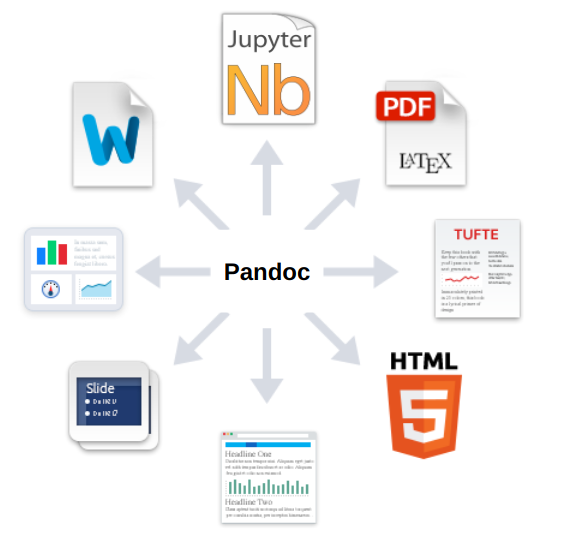

class: inverse, center, middle

# What is Markdown?

???
所以 R Markdown 是什麼？基本上，R Markdown 就是一套寫作的工具。那在了解 R Markdown 是什麼之前，我們需要先知道 Markdown 是什麼。所以我就先從一點點，關於人類寫作工具的歷史開始。

---

## 兩種媒介：紙本 vs. 網頁


---

## 兩種排版方式：WYSIWYM vs. WYSIWYG

### 標記式語言 (What You See Is What You .r[Mean], WYSIWY.r[M])

.pull-left[
#### 編輯 (純文字)

```html
這是<b>粗體字</b>

這是<i>斜體字</i>
```
]

.pull-right[
#### 輸出顯示

這是<b>粗體字</b>

這是<i>斜體字</i>
]

---

## 排版方式：WYSIWYM vs. WYSIWYG

### 圖形化界面 (What You See Is What You .r[Get], WYSIWY.r[G])

.pull-left[
#### 編輯 (圖形化界面)

```{r out.width='100%'}

```
]

.pull-right[
#### 輸出顯示

```{r out.width='100%'}
include_graphics('img/medium_post.png')
```
]

---

## 圖形化界面 vs. 標記式語言

| | 圖形化界面 | 標記式語言 |
| -- | --- | --- |
| 優點 | 易學易用 | 檔案管理容易 |
| 缺點 | 檔案管理不便 | 語法過於複雜，<br>難以專心於寫作內容 |


### 檔案管理不變

> Q: 請在這 200 份**文件**中，找出所有內文含有「三年五班 王小明」的文件

- Word?

- 純文字檔
    ```bash
    grep -r '三年五班 王小明' *.md
    ```

---
background-image: url("https://liao961120.github.io/slides/img/emo/boredom-small.png")
background-size: 100px
background-position: 90% 8%

## 標記式語言：太複雜了


---

## Markdown: 極簡的標記式語言

```{r}
include_graphics('https://collabin.netlify.com/yongfu/write-in-rmd/md2html.png')
```


---

## 玩玩看 Markdown (見下頁語法)

```{r}
include_graphics('img/markdown_demo.gif')
```

.footnote[.smaller[
[jbt.github.io/markdown-editor](https://jbt.github.io/markdown-editor)
]]

---

```{r}
md_syntax <- readLines('md_syntax.txt')
md_syntax <- c('````markdown', md_syntax, '````')
md_syntax <- paste(md_syntax, collapse = '\n')
```

`r asis_output(md_syntax)`

---

## (Pandoc) Markdown: 解決「紙本 vs. 網頁」的衝突




|          | 所見即所得                                     | 所見即所思                       |
|----------|------------------------------------------------|----------------------------------|
| **紙本** | MS Word                                        | $\LaTeX$,<br>Markdown (近年目標)  |
| **網頁** | 部落格文章撰寫後台<br>(e.g. WordPress, Medium) | HTML,<br>Markdown (初創目的) |

.footnote[
[pandoc.org/try](https://pandoc.org/try/)
]
